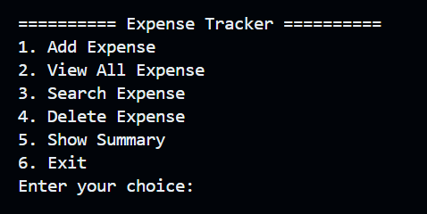

# Expense-Tracker

A simple Expense Tracker built with Java to practice OOP and File IO.

## Features
- Add Expense
- View Expense
- Search Expense
- Delete Expense
- Show Expense Summary

## Technologies
- ArrayList
- Scanner
- File IO

## Project Structure
- **MainConsole.java** - Handles user interaction and menu navigations.           # Entry point
- **Expense.java** - Represents an expense.                                       # Expense model
- **ExpenseManager.java** - Handles reading from and writing to the data file.    # Business logic
- **FileManager.java** - Access to file to read and write data.                   # File operations
- **expenses.txt** - Store expense records.                                       # Data Storage

## Requirements
- Java JDK 17 or above
- Any Java IDE (VS Code, IntelliJ IDEA)

## How to Run
1. Clone the repository.
2. Open the project in IntelliJ IDEA or VS Code.
3. Make sure 'expenses.txt' is in the project directory.
4. Run 'MainConsole.java'.

## Learning Objective 
- Practice Java OOP
- Practice File IO
- Understand the process of developing a project
- Learn Git and GitHub Workflow

## Future Improvement
- Input validation.
- Generate monthly expense reports.
- Store data in a MySQL database using JDBC.
